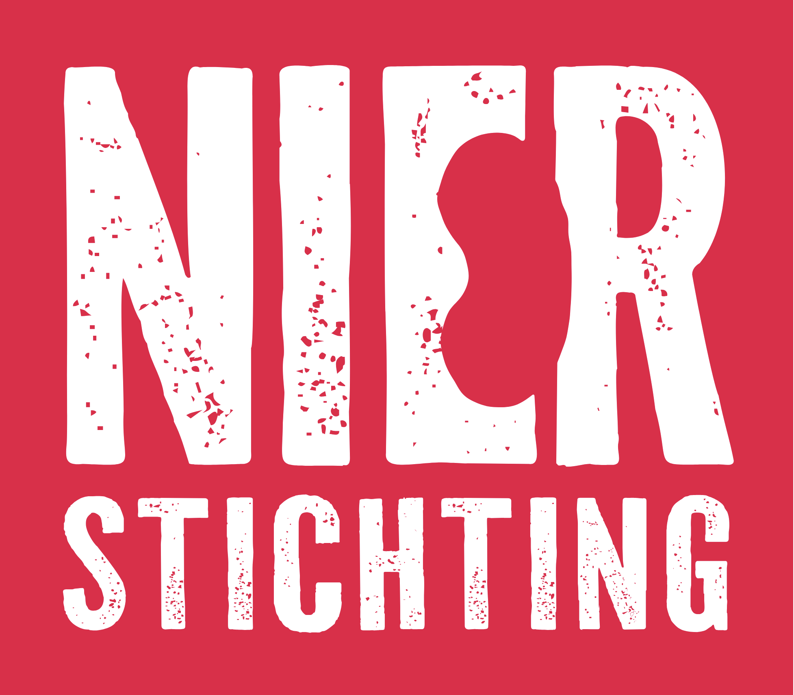

[*These publications are either written by the U-KREAT team or written about work of the U-KREAT team*]{style="font-size: 70%;"}

|||
|-|-----|
||[**Langetermijnsrisico's van acute nierschade**]{style="font-size: 95%;"}\
[Acute nierschade treft jaarlijks tienduizenden ziekenhuispatiënten in Nederland. Dit is zeer schadelijk voor het lichaam en kan mogelijk leiden tot onomkeerbare, chronische nierschade (CKD). Tot nu toe werd aangenomen dat een kortdurende AKI (< 3 dagen) weinig blijvende gevolgen had, maar recent onderzoek vtoont aan dat zelfs kortdurende episodes van AKI het risico op CKD verhogen. Meer [online](https://nierstichting.nl/nieuws/ook-milde-of-kortdurende-aki-vergroot-risico-op-chronische-nierschade)]{style="font-size: 85%;"}|

