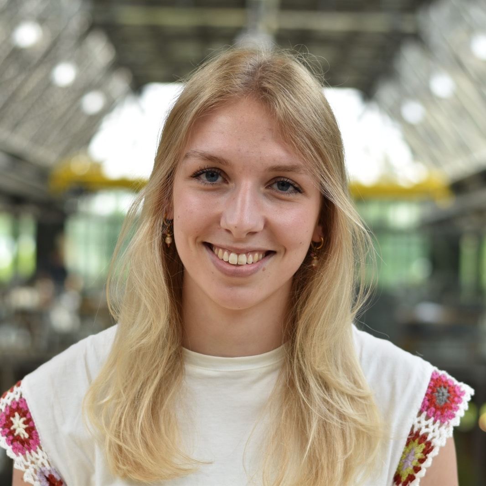

We have a number of overarching research lines, within which we perform most of our research. Besides these research lines, we also collaborate with other researchers on the broader spectrum of cardio-kidney-metabolic epidemiological research and methodological development and innovation.
\
\

## Long-term outcomes after acute kidney injury
Acute kidney injury is an impactful disease that may have long-lasting consequences affecting the cardio-kidney axis. However, these long-term outcomes remain difficult to investigate due to individual heterogeneity in individuals with acute kidney injury, difficulty in defining acute kidney injury, and reliance on smaller datasets. In this research line, we aim to overcome these shortcomings to elucidate the long-term outcomes after acute kidney injury, both through a predicitve lens and a relational lens. 

#### People working on this
::::: {.panel-tabset}
## Denise
:::: columns
::: {.column width="20%"}
{width=90%}
:::

::: {.column width="80%"}
In this line of research, Denise is in the lead. She has written multiple papers on the topic and more analyses are underway. She is responsible for coming up with new avenues within the project, writing papers and performing analyses.
:::
::::

## Robin
:::: columns
::: {.column width="20%"}
{width=90%}
:::

::: {.column width="80%"}
Robin is the principal investigator in this project. He ensures the project is heading in the best direction it can, seeks funding to continue work, and contributes new research ideas. In this role, he supervises Denise.
:::
::::

## Roemer
:::: columns
::: {.column width="20%"}
{width=90%}
:::

::: {.column width="80%"}
Roemer provides assistance from the side line based on his experience in investigating acute kidney injury, helping with programming and offering methdological support where needed.
:::
::::
:::::
\
\

## Cardiovascular risk management in CKD
Individuals with chronic kidney disease (CKD) receive a plethora of medications and the majority of treatment regimens can be categorised as polypharmacy. However, for most medications, evidence on effectiveness and safety in the CKD population is limited. Given the altered drug metabolism and shorter life expectancy of these people, it is of paramount importance to reassess safety and effectiveness of medications in them. Witholding or deprescribing ineffective or unsafe treatment can help reduce medication-related disease burden and avoid adverse side effects. As randomised trials are rarely feasible in this population, we approach this using modern epidemiological methods.

#### People working on this
::::: {.panel-tabset}
## Ellis
:::: columns
::: {.column width="20%"}
{width=90%}
:::

::: {.column width="80%"}
Continuing on the work Julia has done, Ellis is investigating the utilisation of guideline-recommended drugs throughout the hospital. Additionally, she will take the lead on multiple projects investigating the safety and effectiveness of different drugs in individuals with CKD.
:::
::::

## Sam
:::: columns
::: {.column width="20%"}
{width=90%}
:::

::: {.column width="80%"}
For her student thesis, Sam is supporting this project through identifixation of distinct clusters of individuals with chronic kidney disease. These clusters may present readily applicable subgroups in clinical care in which treatment effects and prognosis regarding cardiovascular effects differ.
:::
::::

## Roemer
:::: columns
::: {.column width="20%"}
{width=90%}
:::

::: {.column width="80%"}
Roemer is working together with Ellis to shape the different studies she is performing, additionally strengthening the projects' methodology and providing quality checks on the way data is used and analysed.
:::
::::

## Robin
:::: columns
::: {.column width="20%"}
{width=90%}
:::

::: {.column width="80%"}
Robin has long been working on this, being the supervisor of both Julia and Ellis. He ensures the project's long-term sustainability, gives direction where needed, and connects the team members with the right collaborators.
:::
::::
:::::
\
\

## Alternatives to standard-care haemodialysis
Haemodialysis (HD) is a common dialysis modality, but many alternatives are imaginable that may have benefits over standard HD. Haemodiafiltration (HDF) is a possible alternative to haemodialysis (HD) that uses both diffusion and convection to improve outcomes of individuals on dialysis. The combination of multiple trials have shown benefits of HDF over HD, but more research is needed. The mechanism by which HDF improves outcomes remains unclear, as does the heterogeneity in treatment effects across many populations. In this project, we apply data from multiple trials, as well as large global databases to further investigate the benefit of HDF over HD. Alternatively, we may also try to improve the way HD is offered, for instance by changing the frequency with which HD is provided (i.e. incremental dialysis).

#### People working on this
::::: {.panel-tabset}
## Sanne
:::: columns
::: {.column width="20%"}
{width=90%}
:::

::: {.column width="80%"}
Sanne is combing her clinical knowledge with her research skills to investigate HDF. She is performing multiple studies to assess the mechanisms through which HDF possibly has a benefit over HD. Additionally, she is working with national and international collaborators to assess the effectiveness of HDF in diverse and underrepresented populations.
:::
::::

## Juras
:::: columns
::: {.column width="20%"}
{width=90%}
:::

::: {.column width="80%"}
To better understand the possible mechanisms through which HDF can lead to an improved survival, it is essential to understand the quality of the HDF sessions. Juras is investigating whether the quality of HDF sessions can be quantified through a new metric, similar to Kt/V for HD.
:::
::::

## Tanja
:::: columns
::: {.column width="20%"}
{width=90%}
:::

::: {.column width="80%"}

:::
::::

## Robin
:::: columns
::: {.column width="20%"}
{width=90%}
:::

::: {.column width="80%"}
Robin has done multiple projects on HDF and has now connected global collaborators that will work together with Sanne to further this research under his supervision.
:::
::::

## Roemer
:::: columns
::: {.column width="20%"}
{width=90%}
:::

::: {.column width="80%"}
Roemer has worked with Robin on HDF and is co-supervising Sanne in her work on HDF, providing methodological guidance and aiding in interpreting the results of the different studies.
:::
::::
:::::
\
\

## Personalised care for kidney transplant recipients
Kidney transplant recipients are often treated through a 'one-size-fits-all' perspective. However, it is likely that important individual differences exist. These differences can be quantified through interweaving the related disciplines (nephrology, immunology, virology) in research on heterogeneity in the long-term post-kidney transplantation phase.

#### People working on this
::::: {.panel-tabset}
## Roemer
:::: columns
::: {.column width="20%"}
{width=90%}
:::

::: {.column width="80%"}
Roemer is using his previous experience in working on kidney disease to set-up this new research line. Combining advanced statistical methodology and high-quality large datasets, he will provide new insights while actively seeking funding to sustain this project.
:::
::::

## Robin
:::: columns
::: {.column width="20%"}
{width=90%}
:::

::: {.column width="80%"}
Robin is working together with Roemer to get this research line up and running, helping out with funding. As a core member of this project, he also helps steer the project in the most relevant direction.
:::
::::
:::::

## Interplay between the environment and kidney disease
Environmental factors such as pollution may lead to kidney disease. Conversely, kidney replacement therapy has a large environmental impact as a result of the required water use and high throughput of materials (such as dialysate). This project focusses on better understanding the effects of both the environment on kidney disease and of kidney disease on the environment.

#### People working on this
::::: {.panel-tabset}
## Tibo
:::: columns
::: {.column width="20%"}
{width=90%}
:::

::: {.column width="80%"}
Tibo is leading this research on sustainable innovation for kidney care. Leveraging his understanding of sustainable technology, he aims to reduce the impact of kidney replacement therapy while maintaining quality of care.
:::
::::

## Robin
:::: columns
::: {.column width="20%"}
{width=90%}
:::

::: {.column width="80%"}
Whilst Tibo can focus on the day-to-day research work for this project, Robin is making sure that the project maintains the right direction and that Tibo's skills and time are used most efficiently.
:::
::::
:::::