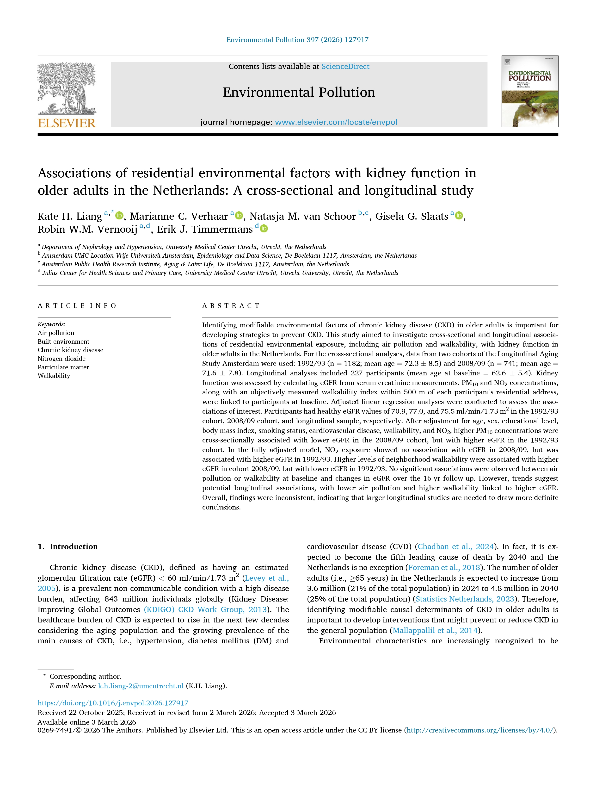

### Long-term outcomes after acute kidney injury

### Cardiovascular risk management in CKD

### Alternatives to standard-care haemodialysis

### Personalised care for kidney transplant recipients

### Interplay between the environment and kidney disease
|||
|-|----|
|{.lightbox}|[**Associations of residential environmental factors with kidney function in Dutch older adults**]{style="font-size: 95%;"}\
[We investigated whether air pollution and how walkable a neighborhood is affects the kidney function of older adults in the Netherlands. The results were inconsistent: while from one cohort we found that higher levels of air pollution were linked to poorer kidney function, other data showed no clear connection. Similarly, living in an easily walkable neighborhood did not show a clear impact on kidney function. Hence, larger studies with a longer  follow-up are needed before we can give a definitive answer on how environmental factors influence kidney health. More [here](https://doi.org/10.1016/j.envpol.2026.127917)]{style="font-size: 85%;"}|

