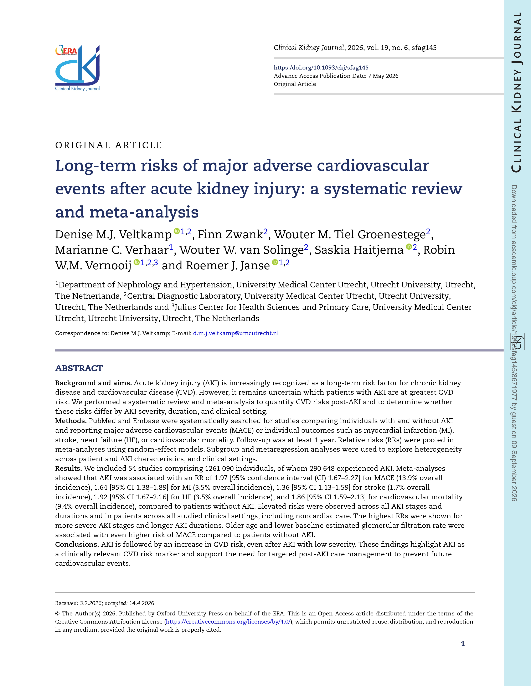
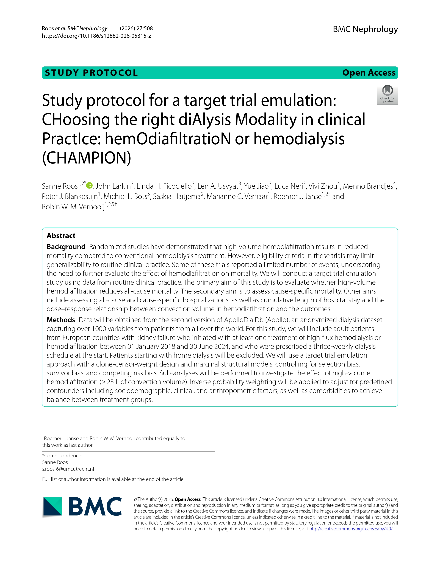
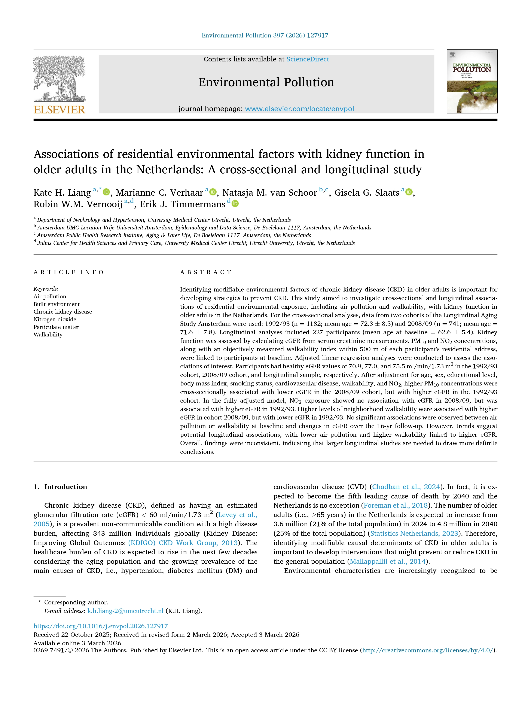

## Elucidating the cardio-kidney-metabolic axis

### Long-term outcomes after acute kidney injury
|||
|-|-------|
|{.lightbox}|[**Long-term risks of major adverse cardiovascular events after acute kidney injury: a systematic review and meta-analysis**]{style="font-size: 95%;"}   [By studying 54 studies that together comprised 1,261,090 individuals, we showed that the relative risk of cardiovascular events after acute kidney injury is severely elevated. Elevated risks remained across AKI stages and duration. More [here](https://doi.org/10.1093/ckj/sfag145)]{style="font-size: 85%;"} |
: {tbl-colwidths="[20,80]"}

### Alternatives to standard-care haemodialysis
|||
|-|-------|
|{.lightbox}|[**Study protocol for a target trial emulation: CHoosing the right diAlysis Modality in clinical PractIce: hemOdiafiltratioN or hemodialysis (CHAMPION)**]{style="font-size: 95%;"}   [We describe the protocol for an observational causal study that aims to investigate the effect of haemodiafiltration as compared to haemodialysis on several outcomes. Analytical details are outlined. More [here](https://doi.org/10.1186/s12882-026-05315-z)]{style="font-size: 85%;"} |
: {tbl-colwidths="[20,80]"}

### Personalised care for kidney transplant recipients

### Interplay between the environment and kidney disease
|||
|-|-------|
|{.lightbox}|[**Associations of residential environmental factors with kidney function in Dutch older adults**]{style="font-size: 95%;"}   [We investigated whether air pollution and how walkable a neighborhood is affects the kidney function of older adults in the Netherlands. The results were inconsistent and larger studies with a longer follow-up are needed before we can give a definitive answer. More [here](https://doi.org/10.1016/j.envpol.2026.127917)]{style="font-size: 85%;"} |
: {tbl-colwidths="[20,80]"}

