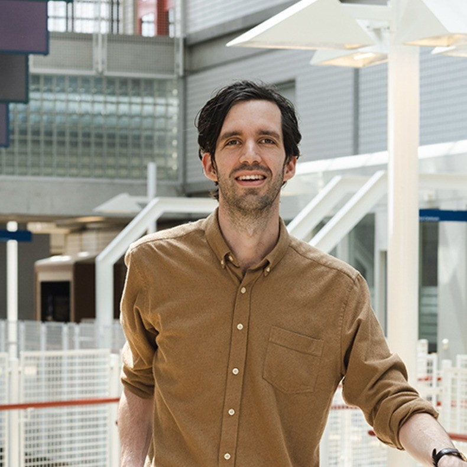
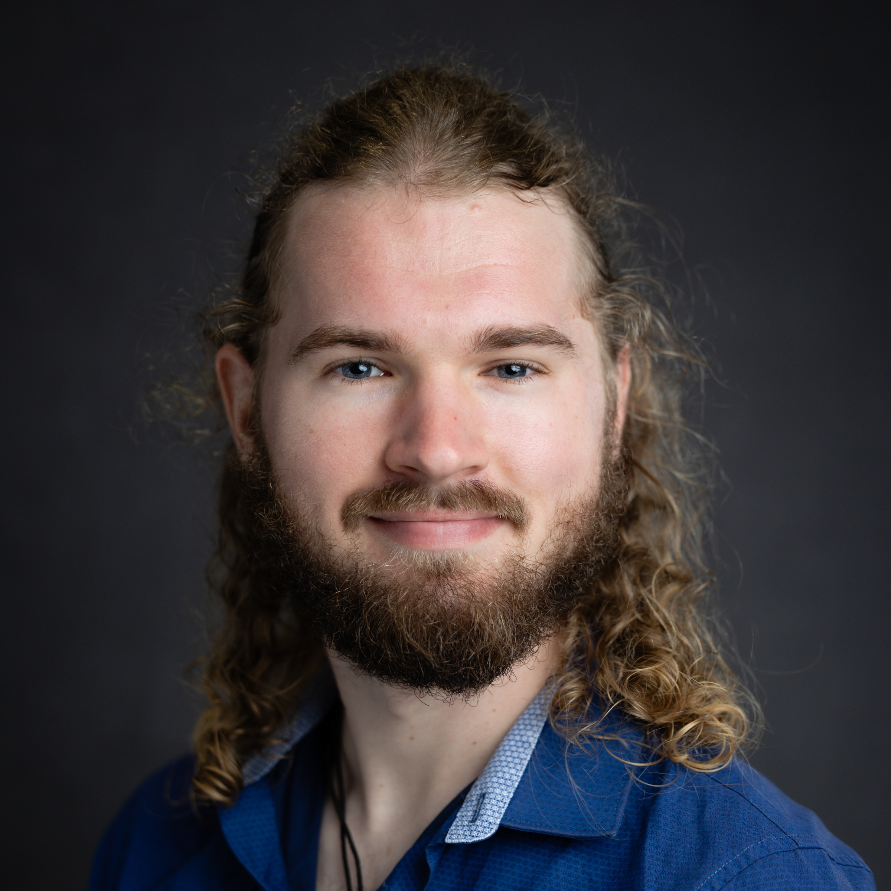
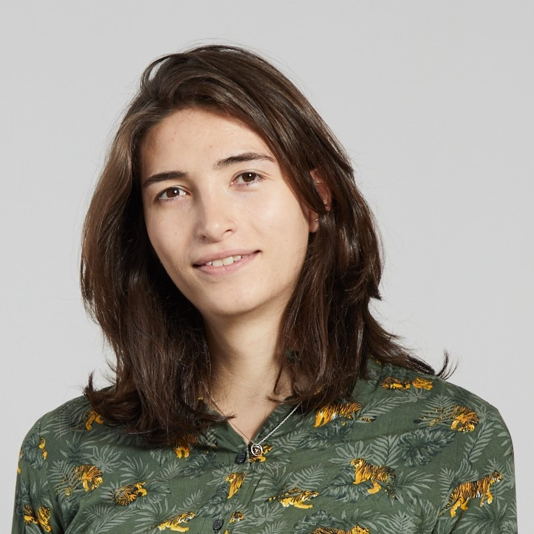
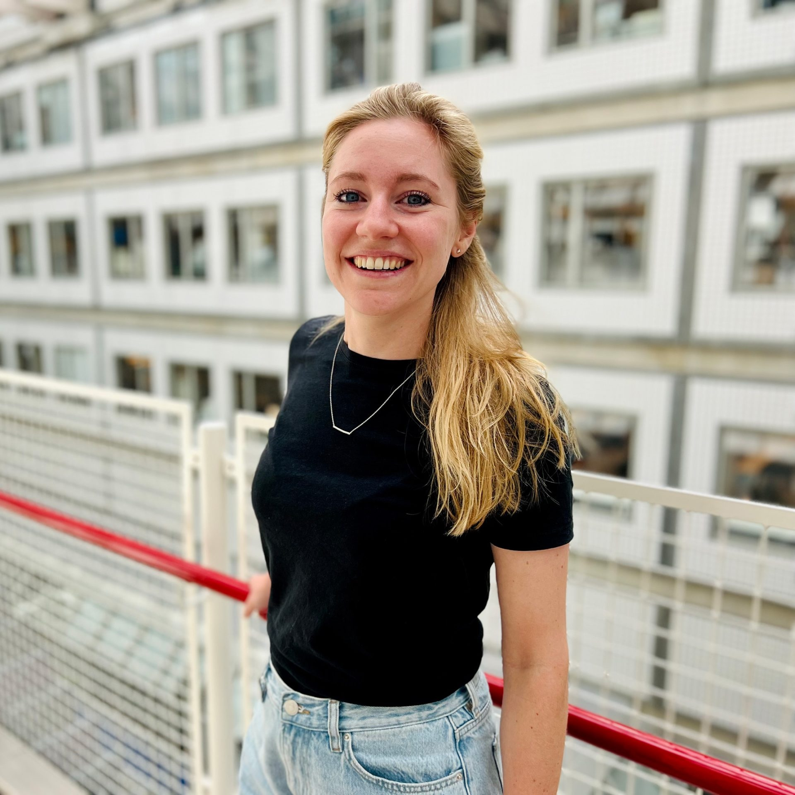
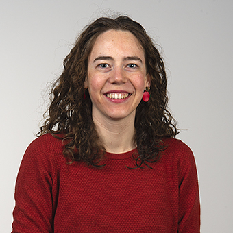
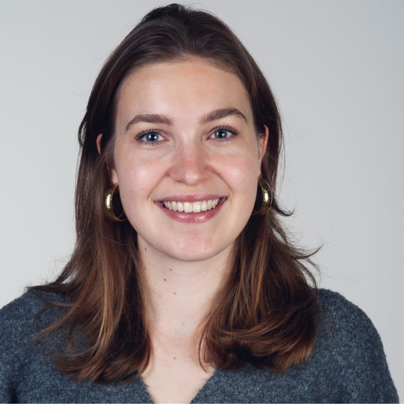
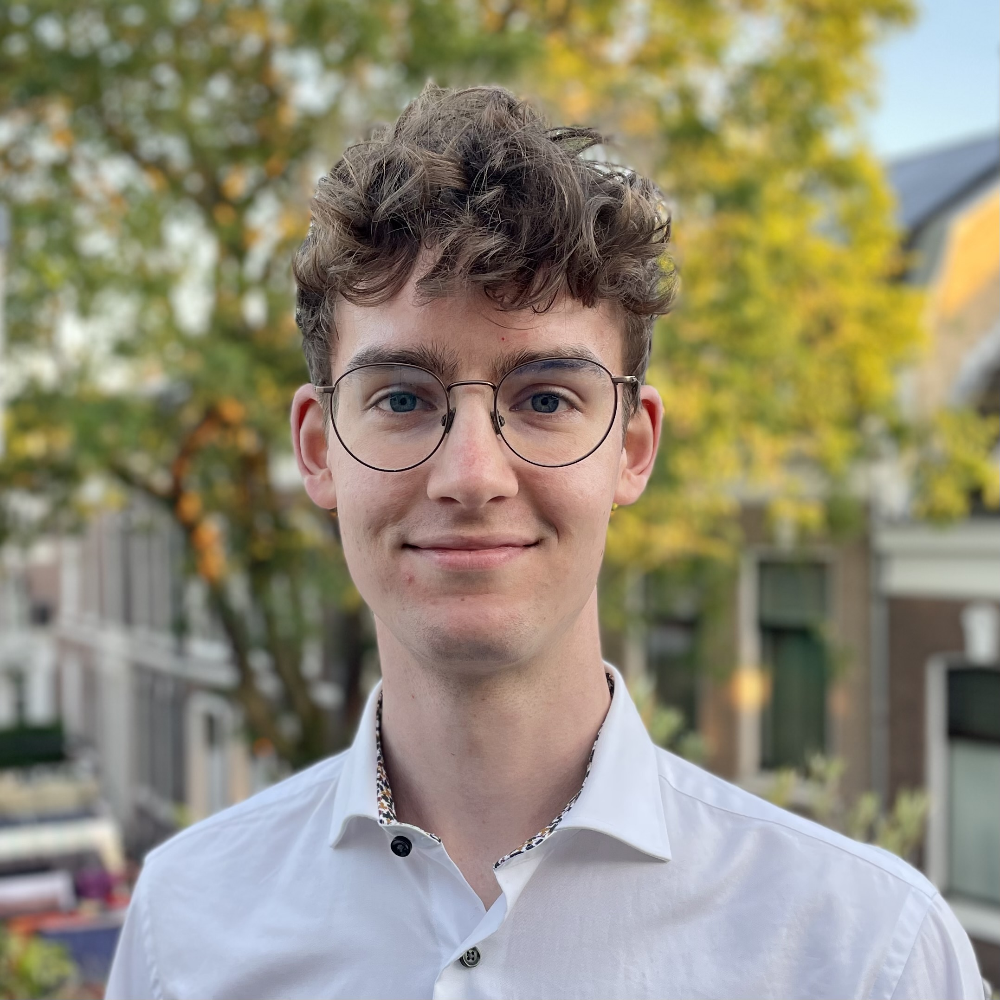
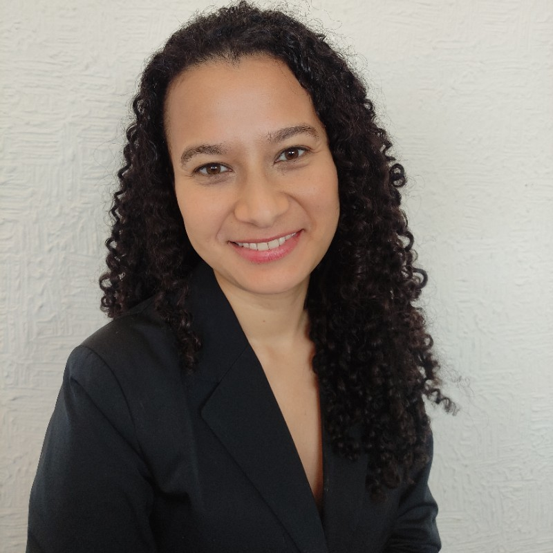

## Members

:::: columns
::: {.column width="20%"}
{width=90%}
:::

::: {.column width="80%"}
[**Robin W. M. Vernooij**]{style="font-size: 120%;"}\
[*ORCID: [0000-0001-5734-4566](https://orcid.org/0000-0001-5734-4566)*]{style="font-size: 90%;"}

[Robin is an assistant professor at the UMC Utrecht, and spearheads this research group. He received his PhD on improving guideline methodology and reporting from the Universitat Autònoma de Barcelona (Spain). Having previously worked at Cochrane and the Dutch Cancer Registry, and currently working as epidemiologist at the Dutch Kidney Registry, Robin's academic work is strengthened by ample experience in registry research and evidence synthesis.]{style="font-size: 80%;"}
:::
::::

:::: columns
::: {.column width="20%"}
{width=90%}
:::

::: {.column width="80%"}
[**Roemer J. Janse**]{style="font-size: 120%;"}\
[*ORCID: [0000-0003-0059-872X](https://orcid.org/0000-0003-0059-872X)*]{style="font-size: 90%;"}

[Roemer is a clinical epidemiologist, working on the interplay of nephrology, immunology, and virology in kidney transplantation recipients. He completed his BSc in Medicine and afterwards finished his PhD on causal inference and prediction modelling in people with CKD, at the Leiden University Medical Center (The Netherlands) and Karolinska Institutet (Sweden). Besides his clinical projects, he provides epidemiological and programming support.]{style="font-size: 80%;"}
:::
::::

:::: columns
::: {.column width="20%"}
{width=90%}
:::

::: {.column width="80%"}
[**Julia M.T. Colombijn**]{style="font-size: 120%;"}\
[*ORCID: [0000-0002-9022-5937](https://orcid.org/0000-0002-9022-5937)*]{style="font-size: 90%;"}

[Julia is a PhD student currently finishing her medical studies. Her PhD research focuses on polypharmacy in individuals with chronic kidney disease. Besides elucidating the extent of polypharmacy in this population, she has also studied the lack of evidence for multiple common cardiorenal protective drugs and has further investigated their use in this population.]{style="font-size: 80%;"}
:::
::::

:::: columns
::: {.column width="20%"}
{width=90%}
:::

::: {.column width="80%"}
[**Denise M.J. Veltkamp**]{style="font-size: 120%;"}\
[*ORCID: [0000-0001-9914-7827](https://orcid.org/0000-0001-9914-7827)*]{style="font-size: 90%;"}

[Denise is a medical doctor whose research focuses on long-term outcomes after acute kidney injury. To get a broad overview, she has performed multiple meta-analyses and clustering studies, and worked on developing prediction models to get personalised insights in these long-term outcomes. Additionally, she has previously done research on the patient perspective in kidney transplantation.]{style="font-size: 80%;"}
:::
::::

:::: columns
::: {.column width="20%"}
{width=90%}
:::

::: {.column width="80%"}
[**Sanne Roos**]{style="font-size: 120%;"}\
[*ORCID: [0009-0004-7225-8542](https://orcid.org/0009-0004-7225-8542)*]{style="font-size: 90%;"}

[Sanne is a medical doctor, doing her PhD on haemodiafiltration. Not only is she investigating the possible mechanisms through which haemodiafiltraiton improves survival; she is also working to assess the effect of haemodiafiltration in a real-world population and obtain individualised estimates of its effect over haemodialysis. Prior to her PhD, she already obtained experience in dialysis research, studying the effects of incremental dialysis.]{style="font-size: 80%;"}
:::
::::

:::: columns
::: {.column width="20%"}
{width=90%}
:::

::: {.column width="80%"}
[**Ellis Oortwijn**]{style="font-size: 120%;"}\
[*ORCID: [0009-0004-5917-8716](https://orcid.org/0009-0004-5917-8716)*]{style="font-size: 90%;"}

[Ellis is a PhD student with a background in cardiovascular health and disease. Bringing with her experience in both fundamental and clinical research, she now focuses on the utilisation, safety, and effectiveness of cardiovascular risk management in individuals with chronic kidney disease.]{style="font-size: 80%;"}
:::
::::

:::: columns
::: {.column width="20%"}
{width=90%}
:::

::: {.column width="80%"}
[**Tibo F. Verburg**]{style="font-size: 120%;"}\
[*ORCID: [*No ORCID*](https://orcid.org/)*]{style="font-size: 90%;"}

[Coming from a background in technology and sustainability, Tibo is doing his PhD on the environmental impact of kidney replacment therapy. His broad understanding of the topic offers him a unique perspective on kidney replacement therapy.]{style="font-size: 80%;"}
:::
::::

### Students
:::: columns
::: {.column width="20%"}
{width=90%}
:::

::: {.column width="80%"}
[**Sam ten Berge**]{style="font-size: 120%;"}\
[*ORCID: [*No ORCID*](https://orcid.org/)*]{style="font-size: 90%;"}

[Sam is doing her MSc in Epidemiology at the University of Utrecht. In light of that, she is doing her thesis with our group on cluster analyses to phenotype patients with chronic kidney disease.]{style="font-size: 80%;"}
:::
::::

:::: columns
::: {.column width="20%"}
{width=90%}
:::

::: {.column width="80%"}
[**Juras J. J. Huijben**]{style="font-size: 120%;"}\
[*ORCID: [*No ORCID*](https://orcid.org/)*]{style="font-size: 90%;"}

[Juras is nearing the end of his medical training. To also get a taste of the scientific side of medicine, he is working with us on better quantifying the effectiveness of haemodiafiltration.]{style="font-size: 80%;"}
:::
::::

## Prevous members
:::: columns
::: {.column width="15%"}
{width=90%}
:::

::: {.column width="85%"}
[**Cindy P. Porras**]{style="font-size: 90%;"}\
[*ORCID: [0000-0001-7692-9164](https://orcid.org/0000-0001-7692-9164)*]{style="font-size: 80%;"}\
[Cindy performed here thesis with us on sex differences in peripheral arterial disease and the interplay between heart failure and kidney disease.]{style="font-size: 75%;"}
:::
::::

